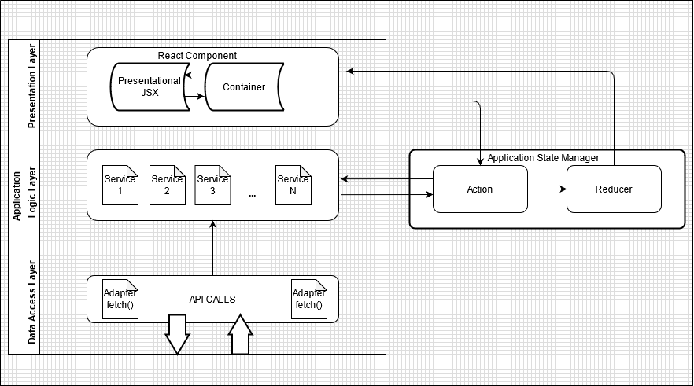

Frontend challenge
====
# General Info

This project is an oversimplified copy of the famous [Unsplash](https://unsplash.com/). This application actually uses its API to fetch images using **lazy-loading** principle on scroll. The images are loaded on a responsive grid: 
for mobile devices and computers. On an image click, the image is open in its full resolution in a modal. The user can
inspect image meta info, download the image and browse next images without closing the modal.
 
# Requirements

- [x] Use the Unsplash API - docs here to set up a developer account: https://unsplash.com/documentation.
- [x] We want to see a grid overview, use the GET /photos/photos endpoint from the Unsplash API to get a set of images.
- [x] The application should be responsive and work both in portrait and landscape modes, on both desktop and mobile.
- [x] The application should support infinite scrolling using a lazy-load to fetch new images as the user scrolls.
- [x] The user can click on a grid element to get a full-width representation of the image with additional meta data.
- [x] The user can navigate to previous or next full-width representation without having to close that view.
- [x] React
- [ ] Tests (Not implemented due to time constraints. A preferable choiche would have been Jest).
- [x] Linter
- [ ] CSSinJS (Not implemented due to time constraints. A preferable choiche would have been Styled Components).

# Technologies
* [Redux] (https://react-redux.js.org/introduction/getting-started) 
* [Redux Thunk Middleware] (https://www.npmjs.com/package/redux-thunk)
* [Semantic Ui React] (https://react.semantic-ui.com/)

# Development

The requirement was to build a clean React app. To keep it as simple as possible, roughly two technologies were used:
Redux and Semantic Ui React.
**Redux** was used to keep the application state clean and accessible without having to pass props up and down through components. Redux Thunk was implemented to dispatch and return function in actions. This is especially useful when dealing with API data.

Advantages:
+ State management through Actions.
+ State is Globally accessable.
+ Useful when a child component should trigger based on changes in parent/sibling component (Modal).

Disadvantages:
- Lots of boilerplate code.
- May be overkill for such a small application.

**Semantic UI React** is a simple and intuitive UI library. This was picked to quickly implement prebuild HTML structures
such as Modals, Grids, Icons. Moreover, the Grid structure contains responsive attributes for different screen sizes.

Advantages
+ Easy Implementation of sofisticated structures: Responsiveness, Modal functions
+ Pleasing look and minimalistic design
+ Good Documentation

Disadvantages
+ Components come with predifined CSS styling, making it too difficult to overwrite it.

# Architecture

The project was developed using the following architecture:

The **Data Access Layer** is composed of scripts that only make API Calls with fetch().
The **Logic Layer** is composed of various services. These services hold various business logic functions and are called
by higher layers of the application. In this way the code is more readable.
The **Presentation Layer** is composed of React Components. Withing these components there is a hierachy of parent and children. A component itself is split into two scripts: 
 - Presentational - a jsx file containing jsx syntax for the page
structure
 - Container - a js script that imports the Presentational jsx file, applies logic to it and returns a React Component.

Alongside these layers, there is a **State Manager** implemented with **Redux**.

The decision for this architecture was to separate as much as possible the concerns. In this way, each layer has one function and the data flow can be tracked easely. Also this application was build with the idea of potential scalability.

Advantages:
+ Clean code.
+ Separation of concerns.
+ Scalable and maintainable code.

Disadvantages:
- Lots of boilerplate code.
- Adds complexity for such a small application.

# Future Work

This project can be further improved by:
* Writing tests.
* Use Styled Components over Semantic UI components
(The above will fix the awkwardness of some current parts of the application that don't scale well when the window is being resized: next image arrows, image info button, meta info)
* General cosmetic adjusments: nice font for title

# Installation

* git clone https://github.com/Louliett/code-challenge-frontend.git
* cd code-challenge-frontend
* npm install
* npm start

# Deployment

[Splash] (https://louliett.github.io/code-challenge-frontend/)

# License

This project is licensed under MIT. Feel free to use it anyway you see fit.
